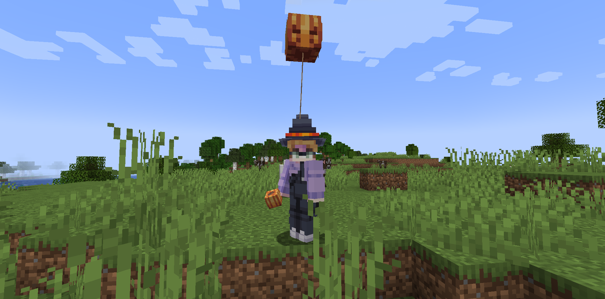

# BalloonsByJens
Cool balloons inside your Minecraft server!

## Features
- Balloons when you hold a skull in your hand (with the correct lore)
- Animations when you move
- Static animations

## How to use
1. Get a skull with any texture on it
2. Give it the lore "Balloon"
3. Enjoy your balloon!

## Disclaimer
This plugin is made for spigot 1.18.2 and up :)